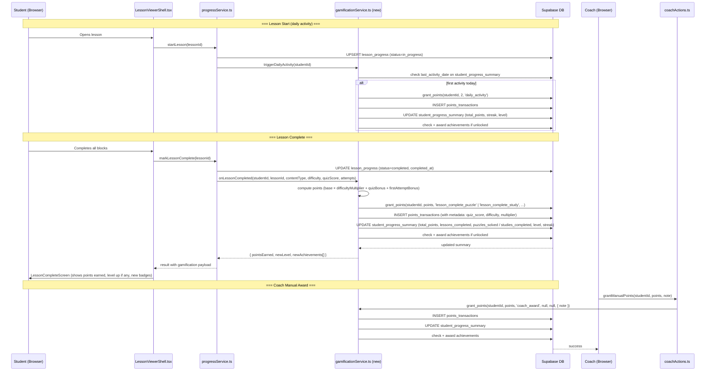

# Gamification System Design
**Last updated:** 2026-04-10  
**Status:** Planning — not yet implemented

---

## Design Decisions (confirmed)

| Decision | Choice |
|---|---|
| Tier assignment | Coach sets manually on each student |
| Levels | 6 (Pawn → King) |
| Negative points | No |
| Leaderboard reset | All-time (no reset) |
| Student point visibility | Leaderboards only, or on shared/assigned lessons |
| Active lesson types | Puzzle and Study only (Quiz/MCQ/Video blocks not yet built) |

---

## Action Types & Base Point Values

These are the only events that trigger a points grant. Every grant is recorded in `points_transactions`.

| `action_type` | Base Points | Notes |
|---|---|---|
| `lesson_complete_puzzle` | 15 | Puzzle-type lesson fully completed |
| `lesson_complete_study` | 20 | Study-type lesson fully completed (more effort) |
| `quiz_bonus` | 0–15 | `round((score / 100) × 15)` — awarded alongside lesson_complete |
| `first_attempt_mastery` | 10 | 80%+ quiz score on first attempt |
| `daily_activity` | 2 | First lesson interaction of the calendar day |
| `streak_bonus` | 5 | Awarded each day on a streak (days 3–6) |
| `streak_weekly` | 50 | Awarded on completing a 7-day streak (one-off per 7-day run) |
| `coach_award` | custom | Coach manually grants points with a note |

### Difficulty Multiplier

Applied to `lesson_complete_*` base only (not quiz bonus or streak).

| Difficulty | Multiplier |
|---|---|
| Easy | × 1.0 |
| Medium | × 1.25 |
| Hard | × 1.5 |

**Example:** Hard study lesson completed with 90% quiz score  
= `round(20 × 1.5)` + `round(0.9 × 15)` = 30 + 14 = **44 pts**

---

## Streak Design

```
Day 1–2:  no streak bonus (just base lesson points)
Day 3–6:  +5 pts/day streak bonus per day
Day 7:    +50 pts (weekly milestone bonus)
Day 8+:   cycle repeats (day 8 = day 1 of new cycle)
```

- A "streak day" = any day where at least one lesson was started or completed
- Streak breaks if a calendar day passes with no activity
- `last_activity_date` on `student_progress_summary` is used to compute streak continuity
- `current_streak_days` resets to 0 on a missed day; `longest_streak_days` is never decremented

---

## Levels — Chess Themed

Six named levels with clear visible thresholds. Students always know how far they are from the next level.

| Level | Name | Points Required | Points to Next |
|---|---|---|---|
| 1 | Pawn | 0 | 100 |
| 2 | Knight | 100 | 200 |
| 3 | Bishop | 300 | 300 |
| 4 | Rook | 600 | 400 |
| 5 | Queen | 1,000 | 500 |
| 6 | King | 1,500 | — |

**DB formula** (replaces the existing `floor(sqrt(total_points / 100)) + 1`):

```sql
level = CASE
  WHEN total_points >= 1500 THEN 6
  WHEN total_points >= 1000 THEN 5
  WHEN total_points >=  600 THEN 4
  WHEN total_points >=  300 THEN 3
  WHEN total_points >=  100 THEN 2
  ELSE 1
END
```

---

## Achievements Catalog (code-side)

Achievements are defined in app code as a constant catalog. Only **earned** achievements are stored in the `student_achievements` DB table. Checks run inside `grant_points` after the points update.

```ts
// src/lib/constants/achievements.ts (to be created)

export type AchievementKey = typeof ACHIEVEMENTS[number]['key']

export const ACHIEVEMENTS = [
  // ── Milestone ──────────────────────────────────────────────────
  {
    key: 'first_lesson',
    name: 'First Steps',
    description: 'Complete your first lesson',
    icon: '🎯',
    check: (stats) => stats.lessons_completed >= 1,
  },
  {
    key: 'five_lessons',
    name: 'Scholar',
    description: 'Complete 5 lessons',
    icon: '📚',
    check: (stats) => stats.lessons_completed >= 5,
  },
  {
    key: 'ten_lessons',
    name: 'Dedicated',
    description: 'Complete 10 lessons',
    icon: '🏅',
    check: (stats) => stats.lessons_completed >= 10,
  },
  {
    key: 'twenty_five_lessons',
    name: 'Master Student',
    description: 'Complete 25 lessons',
    icon: '🏆',
    check: (stats) => stats.lessons_completed >= 25,
  },

  // ── Streak ─────────────────────────────────────────────────────
  {
    key: 'streak_3',
    name: 'On Fire',
    description: '3-day activity streak',
    icon: '🔥',
    check: (stats) => stats.current_streak_days >= 3,
  },
  {
    key: 'streak_7',
    name: 'Week Warrior',
    description: '7-day activity streak',
    icon: '⚡',
    check: (stats) => stats.longest_streak_days >= 7,
  },
  {
    key: 'streak_30',
    name: 'Iron Will',
    description: '30-day activity streak',
    icon: '💎',
    check: (stats) => stats.longest_streak_days >= 30,
  },

  // ── Mastery ────────────────────────────────────────────────────
  {
    key: 'perfect_quiz',
    name: 'Perfect Score',
    description: 'Get 100% on a quiz',
    icon: '⭐',
    check: (stats) => stats.had_perfect_quiz === true,
  },
  {
    key: 'first_attempt_master',
    name: 'Sharp Mind',
    description: 'Score 80%+ on first attempt, 3 lessons in a row',
    icon: '🧠',
    check: (stats) => stats.consecutive_first_attempt_mastery >= 3,
  },

  // ── Puzzle ─────────────────────────────────────────────────────
  {
    key: 'puzzle_debut',
    name: 'Puzzle Solver',
    description: 'Complete your first puzzle lesson',
    icon: '♟️',
    check: (stats) => stats.puzzles_solved >= 1,
  },
  {
    key: 'puzzle_hunter',
    name: 'Puzzle Hunter',
    description: 'Complete 10 puzzle lessons',
    icon: '🎲',
    check: (stats) => stats.puzzles_solved >= 10,
  },

  // ── Study ──────────────────────────────────────────────────────
  {
    key: 'chess_scholar',
    name: 'Chess Scholar',
    description: 'Complete your first study lesson',
    icon: '📖',
    check: (stats) => stats.studies_completed >= 1,
  },
  {
    key: 'deep_thinker',
    name: 'Deep Thinker',
    description: 'Complete 5 study lessons',
    icon: '🔭',
    check: (stats) => stats.studies_completed >= 5,
  },

  // ── Coach-awarded (manual only — no check fn, coach triggers) ──
  {
    key: 'most_improved',
    name: 'Most Improved',
    description: 'Awarded by coach',
    icon: '📈',
    check: null,
  },
  {
    key: 'star_student',
    name: 'Star Student',
    description: 'Awarded by coach',
    icon: '🌟',
    check: null,
  },
  {
    key: 'tournament_ready',
    name: 'Tournament Ready',
    description: 'Awarded by coach — ready for competition',
    icon: '♛',
    check: null,
  },
] as const
```

---

## What Triggers Points — Sequence Diagram



---

## Codebase Integration Points

These are the exact files/functions that will need changes when implementation begins.

| File | Function | Change Needed |
|---|---|---|
| `src/services/progressService.ts` | `markLessonComplete()` | Call `onLessonCompleted()` from gamificationService after DB update |
| `src/services/progressService.ts` | `startLesson()` | Call `triggerDailyActivity()` from gamificationService |
| `src/repositories/lesson/studentRepository.ts` | `derivePoints()` | Remove — replace with reading `total_points` from `student_progress_summary` |
| `src/actions/academy/coachActions.ts` | _(new action)_ | Add `grantManualPoints(studentId, points, note)` |
| `src/app/academy/lesson/[lessonId]/_components/LessonViewerShell.tsx` | lesson complete handler | Receive and display gamification result (points, level up, achievements) |

### Tables that will be added (new migration)

| Table | Purpose |
|---|---|
| `academy_profiles` | Student tier (beginner/intermediate/advanced), username, elo_rating |
| `points_transactions` | Full audit ledger of every point ever granted |

### Tables from existing migration (not yet run)

| Table | Status | Notes |
|---|---|---|
| `student_progress_summary` | Not run | Core — run before implementation |
| `student_achievements` | Not run | Run with above |
| `student_study_progress` | Not run | Study chapter tracking |
| `update_student_progress()` | Not run | Will be replaced/wrapped by `grant_points()` |
| `award_achievement()` | Not run | Keep — called internally by grant_points |
| `handle_student_created` trigger | Not run | Keep — auto-creates summary on new student |

---

## Notes & Open Questions

- Table is `coach_students` throughout. Any reference to `student_coach_assignments` in academy pages is a bug/mismatch to fix.
- Quiz block (`McqViewerBlock.tsx`) exists in the viewer but is not yet wired to `updateQuizScore()`. When it is built, it becomes another trigger for `quiz_bonus` points.
- `updateQuizScore()` in `progressService.ts` does not currently fire any gamification logic — this is an integration point for the future.
- Leaderboard is all-time (no reset). Segmented by tier: beginner / intermediate / advanced.
- Coach sets tier manually via the student management UI (`/academy/students`).
